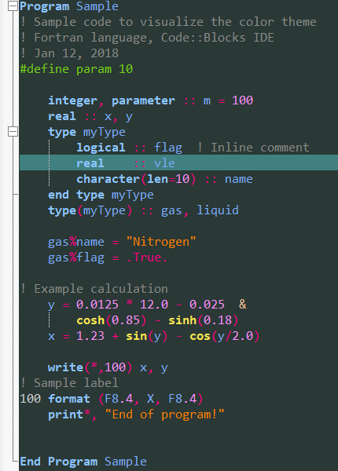
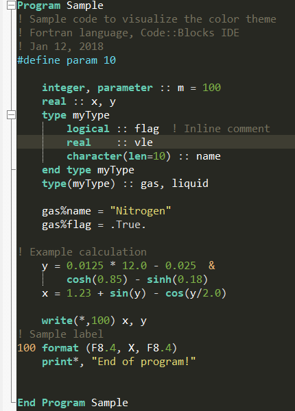
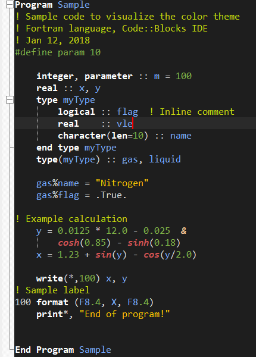
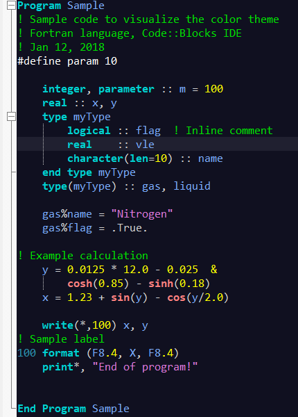
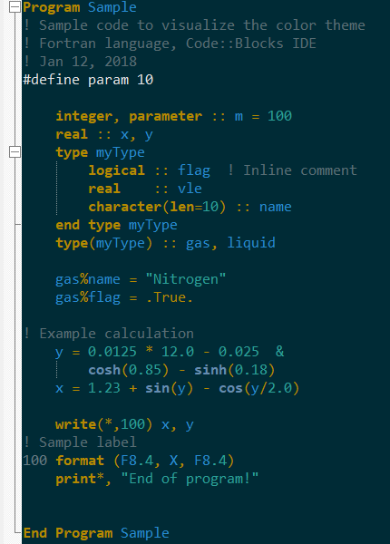
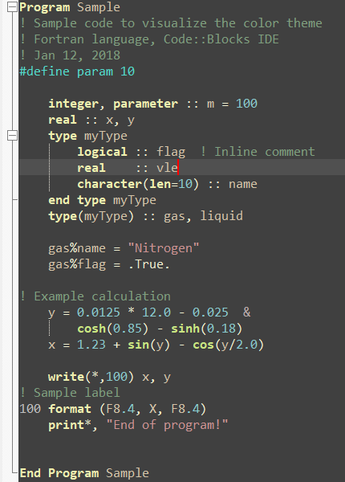
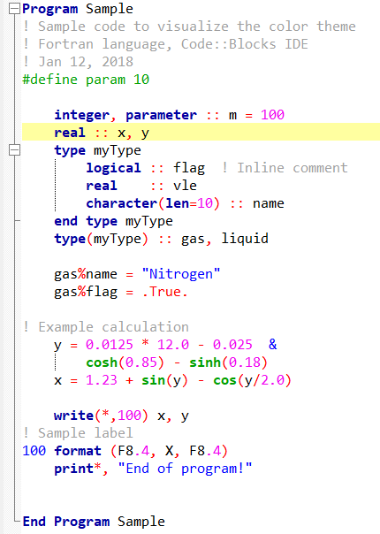
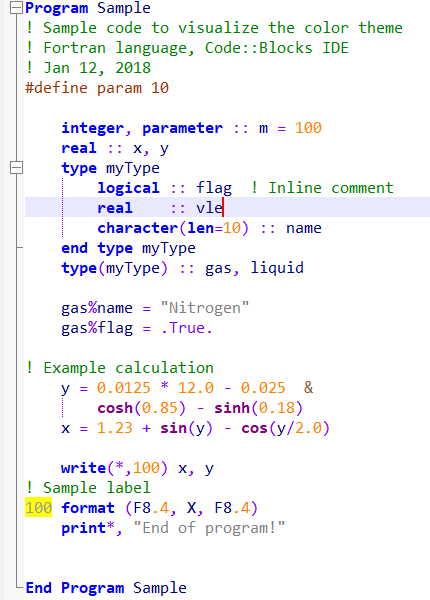
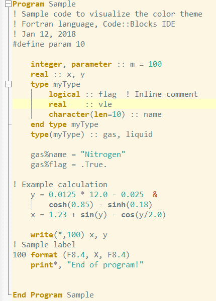

# CB-Fortran-Color-Theme
Code Blocks color theme for Fortran language 

This is a small repository containing some color themes for Fortran (90 and later)
to be used in [Code Blcoks](www.codeblocks.org).
## Installation
* Download the **fortran_colorthemes.conf**
* Follow the instruction on [Change Editor Theme for Code::Blocks ](https://medium.com/@yzhong.cs/change-editor-theme-for-code-blocks-windows-linux-mac-92e9c15cbca4). 
Note that, all the nodes from **fortran_colorthemes.conf** shall be copied to **default.conf**. If you want only few themes, choose those nodes with theme name of your choice!
* Open Code::Blocks
* From **Settings menu**, choose  **Editor...** and then **Syntax highlighting**. Select the **color theme** drop down menu and choose your theme of choice!
* The below screenshots uses the "consolas" regular size 10 font [from Editor/General Settings/Editor Settings/Font]

#### Note
Some theme names and color specification are borrowed from
[Eclipse Themes](http://www.eclipsecolorthemes.org/)

*License*: MIT

## Screenshot

### **Dark themes**

* Dark Gray

* Monokai

* Oblivion

* RecognEyes

* Solarized Dark

* Zenbum

### **Light themes**

* Default Code::Blocks theme

* Minimal

* Notepad++

* Solarized Light

