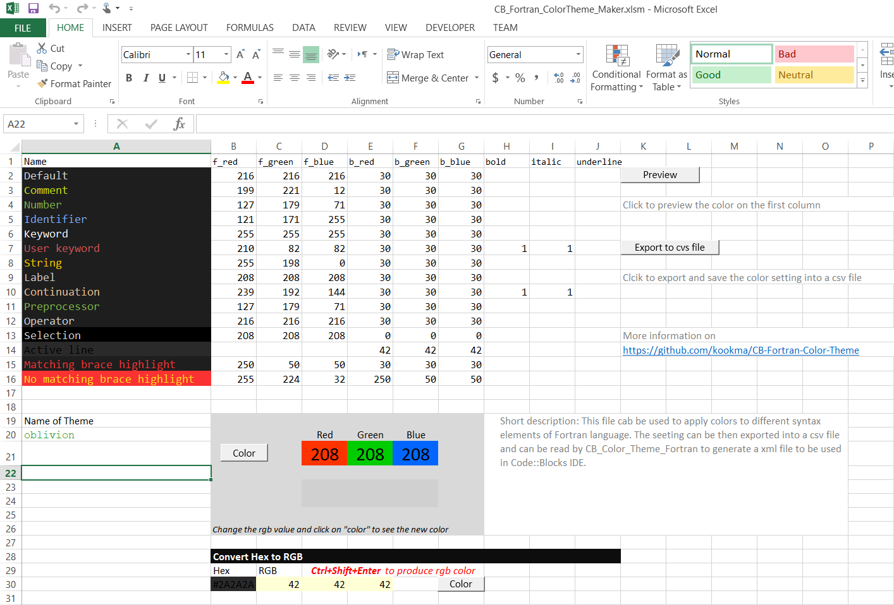

### Code::Blocks Theme Maker for Fortran Language
This folder contains a fortran code to create a Code::Blocks theme for Fortran language. It consist of

1. A Fortran code to make a theme.conf from a CSV file contains the RGB and font style values for each syntax element
2. A csv file for setting the colors for each syntax element

### How to use
Simply open the csv file and set the foreground and background colors as well as the
font style (bold, italics, underlined) for each element.
Then:
1. Run the CB_Fortran_ColorTheme.f90 and give the above csv as input
2. Choose a name for color theme
3. Import the created conf file into C::B configuration (default.conf)
4. Open C::B and from setting/editor/syntax highlighting choose the new theme

### Automatic csv generation
An Excel (2013) file has been provided to visually set the colors and font style of each syntax element.
This excel file can export your color setting into a csv file to be used by CB_Fortran_ColorTheme.f90 to 
generate the .conf file.

Excel file: CB_Fortran_ColorTheme_Maker.xlsm

## Screenshot

**Excel sheet for automatic generation of csv**

